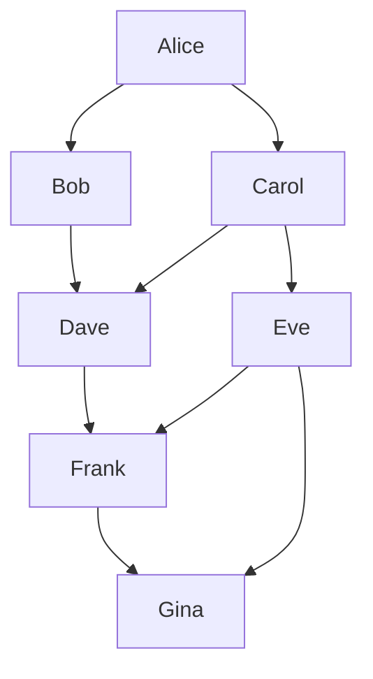
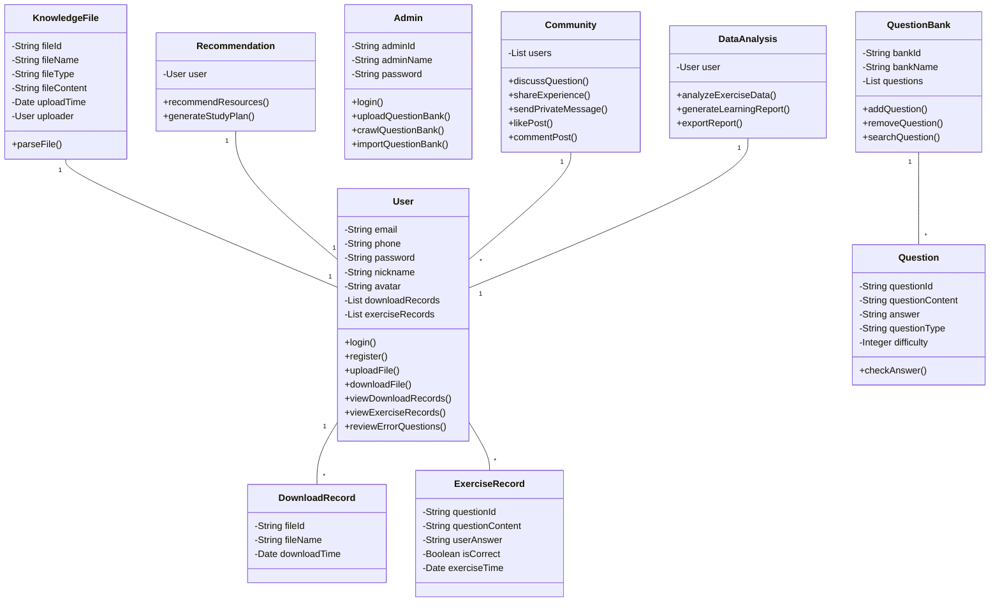

---
categories:
  - 博客搭建
cover: /img/loading.gif
index_img: /img/loading.gif
tags:
  - test
  - blog
title: test.md
date: 2025-01-17 10:11:20
---
# This is a post for test

本文是对新博客编辑器功能的测试。

[配置指南](https://hexo.fluid-dev.com/docs/guide/)


> [!SUCCESS]
>
> 

```kanban
use strict
# How to use kanban

## Grammar
* General (H1: Kanban title\nH2: Kanban Board\nList: Kanban Task)
- Style (Supports Markdown inline styles: **bold**, *italic*, `code`, ~~delete~~, [link](https://github.com/obgnail/typora_plugin), )
- Strict Mode (Use `use strict` on the first line to enforce strict mode; syntax errors will not be ignored.)
- Hide desc box when empty

## Settings
- Unlimited Quantity (Kanban boards and tasks are infinitely scalable.)
- Customizable Color Scheme (Customize colors in settings.)
- Long Task Lists (Scroll task lists using the mouse wheel below the Kanban board.)
- Many Kanban Boards (Scroll horizontally using Ctrl+mouse wheel.)

## NOTE
- Non Universal Grammar (Intended for temporary use in daily task management.)
```

## 1. Mermaid






## 2. 公式

```latex
单行使用一个$符号，换行使用两个$符号
计算公式1：$\int_{a}^{b} x^2 dx$<br>计算公式2：$\int_{a}^{b} x^3 dx$<br>$$\int_{a}^{b} x^2 dx$$
$$
Q = XW^Q, \quad K = XW^K, \quad V = XW^V
$$

```

单行使用一个$符号，换行使用两个$符号
计算公式1：$\int_{a}^{b} x^2 dx$<br>计算公式2：$\int_{a}^{b} x^3 dx$<br>

$$
\int_{a}^{b} x^2 dx
$$

$$
Q = XW^Q, \quad K = XW^K, \quad V = XW^V
$$

## 3. 代码

```c++
#include<bits/stdc++.h>
using namespace std;
int main(){
    cout<<"hello world"<<endl;
    return 0;
}
```

…
